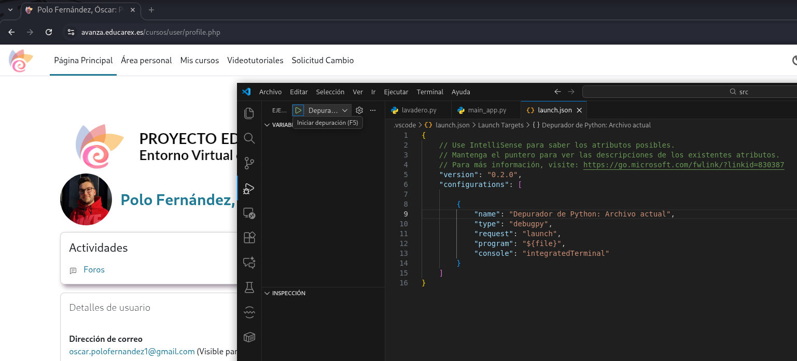
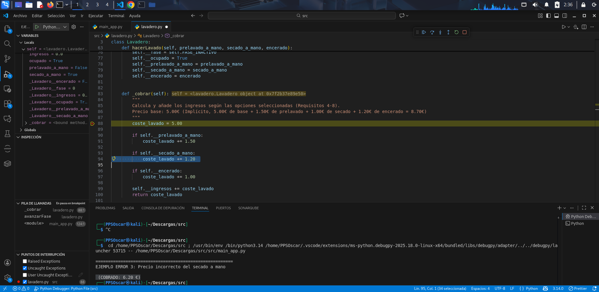
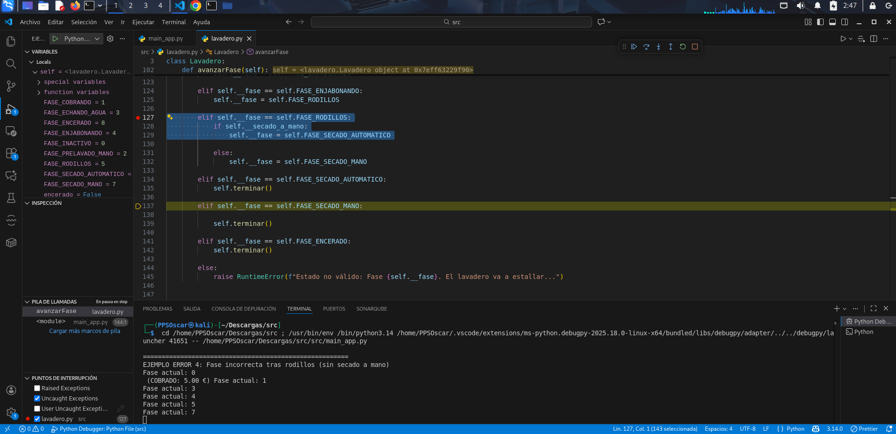

# Ejecución y Depuración

En este apartado muestro, en primer lugar, la corrección del código y, a continuación, la ejecución y depuración del código. Pueden verse en cada apartado las correcciones realizadas.

---

## 1. Corrección del código

- En mi IDE, utilizaré la herramienta de Ejecución y Depuración que viene integrada en el entorno para ejecutar, depurar, ver los errores del código y corregirlos.

En primer lugar, desde la propiar herramienta de depuración crearé un archivo .json para la automatización de la depuración. En mi caso, le he creado dentro del propio proyecto y muestro la herramienta preparada para depurar los archuvos.



- Error 1. Iniciar un lavado estando ocupado: El tipo de excepción que se produce no es correcto, debe lanzarse _ValueError_ y no _RuntimeError_.

Mediante la ejecución de dos llamadas consecutivas al método hacerLavado sin finalizar el primer ciclo, y usando un breakpoint en la validación de estado, compruebo que el sistema detecta que el lavadero está ocupado y lanza una excepción.


Solución:

``` raise ValueError("No se puede iniciar un nuevo lavado mientras el lavadero está ocupado")```
 

Ejemplo añadido al main para ejecutar la depuración y probar el error:

```
lavadero_error = Lavadero()

try:
    # Primer lavado (arranca correctamente)
    lavadero_error.hacerLavado(prelavado_a_mano=False,
                               secado_a_mano=False,
                               encerado=False)

    print("Primer lavado iniciado correctamente")

    # Segundo lavado SIN terminar el primero
    lavadero_error.hacerLavado(prelavado_a_mano=True,
                               secado_a_mano=False,
                               encerado=False)

except Exception as e:
    print(f"EXCEPCIÓN CAPTURADA: {type(e).__name__} -> {e}") # Esperado: RuntimeError
```


- Error 2. Precio incorrecto del secado a mano: Según el enunciado, el total deberían de ser 6€ y no 6,20€.



Solución:

```      if self.__secado_a_mano: 
	 coste_lavado += 1.00 
```

Ejemplo añadido al main para ejecutar la depuración y probar el error:

```
print("\n=======================================================")
print("EJEMPLO ERROR 3: Precio incorrecto del secado a mano")

lavadero_error3 = Lavadero()

# Lavado SOLO con secado a mano
lavadero_error3.hacerLavado(prelavado_a_mano=False,
                            secado_a_mano=True,
                            encerado=False)

# Avanzamos SOLO UNA FASE para que se cobre
lavadero_error3.avanzarFase()

print(f"Ingresos tras el cobro: {lavadero_error3.ingresos:.2f} €")
```

- Error 3: Fase incorrecta tras rodillos (condición invertida): Sin secado a mano debería de pasar a secado automático (fase 6).



Solución:

```
       elif self.__fase == self.FASE_RODILLOS:
            if self.__secado_a_mano:
                self.__fase = self.FASE_SECADO_MANO

            else:
                self.__fase = self.FASE_SECADO_AUTOMATICO
```
 
Ejemplo añadido al main para ejecutar la depuración y probar el error:


```
print("\n=======================================================")
print("EJEMPLO ERROR 4: Fase incorrecta tras rodillos (sin secado a mano)")

lavadero_error4 = Lavadero()

# Lavado SIN secado a mano
lavadero_error4.hacerLavado(prelavado_a_mano=False,
                            secado_a_mano=False,
                            encerado=False)

# Avanzamos fases manualmente
while lavadero_error4.ocupado:
    print(f"Fase actual: {lavadero_error4.fase}")
    lavadero_error4.avanzarFase()

print(f"Fase final: {lavadero_error4.fase}")
```

- Error 4. La fase de encerado (fase 8) nunca se ejecuta: La fase 8 nunca se ejecuta, incumpliendo el enunciado.


Solución:

```
elif self.__fase == self.FASE_SECADO_MANO:
    if self.__encerado:
        self.__fase = self.FASE_ENCERADO
    else:
        self.terminar()

elif self.__fase == self.FASE_ENCERADO:
    self.terminar()
```

Ejemplo añadido al main para ejecutar la depuración y probar el error:

```
print("\=======================================================")
print("EJEMPLO ERROR 5: La fase de encerado nunca se ejecuta")

lavadero_error5 = Lavadero()

# Lavado con secado a mano y encerado
lavadero_error5.hacerLavado(prelavado_a_mano=False,
                            secado_a_mano=True,
                            encerado=True)

# Avanzamos fases y mostramos todas
while lavadero_error5.ocupado:
    print(f"Fase actual: {lavadero_error5.fase}")
    lavadero_error5.avanzarFase()

print(f"Fase final: {lavadero_error5.fase}")
```

---

## 2.  Código corregido

A continuación muestro el código completo del programa con los errores comentados corregidos:

- main_app.py

```
# main_app.py

# Importar la clase desde el otro archivo (módulo)
from lavadero import Lavadero

# MODIFICACIÓN CLAVE AQUÍ: La función ahora acepta 3 argumentos
def ejecutarSimulacion(lavadero, prelavado, secado_mano, encerado):
    """
    Simula el proceso de lavado para un vehículo con las opciones dadas.
    Ahora acepta una instancia de lavadero.

    :param lavadero: Instancia de Lavadero.
    :param prelavado: bool, True si se solicita prelavado a mano.
    :param secado_mano: bool, True si se solicita secado a mano.
    :param encerado: bool, True si se solicita encerado.
    """
   
# Se muestran las opciones solicitadas al inciar el lavado. Se muestran las excepciones
 
    print("--- INICIO: Prueba de Lavado con Opciones Personalizadas ---")
    
    # Mostrar las opciones solicitadas
    print(f"Opciones solicitadas: [Prelavado: {prelavado}, Secado a mano: {secado_mano}, Encerado: {encerado}]")

    # 1. Iniciar el lavado
    try:
        # Esto establece las opciones y pasa a Fase 0 (Inactivo, pero Ocupado=True)
        lavadero.hacerLavado(prelavado, secado_mano, encerado)
        print("\nCoche entra. Estado inicial:")
        lavadero.imprimir_estado()

        # 2. Avanza por las fases
        print("\nAVANZANDO FASE POR FASE:")
        
        # Usamos un contador para evitar bucles infinitos en caso de error o bucles inesperados
        pasos = 0
        while lavadero.ocupado and pasos < 20: 
            # El cobro ahora ocurre en la primera llamada a avanzarFase (transición 0 -> 1)
            lavadero.avanzarFase()
            print(f"-> Fase actual: ", end="")
            lavadero.imprimir_fase()
            print() 
            pasos += 1
        
        print("\n----------------------------------------")
        print("Lavado completo. Estado final:")
        lavadero.imprimir_estado()
        print(f"Ingresos acumulados: {lavadero.ingresos:.2f} €")
        print("----------------------------------------")
        
    except ValueError as e: # Captura la excepción de regla de negocio (Requisito 2)
        print(f"ERROR DE ARGUMENTO: {e}")
    except RuntimeError as e: # Captura la excepción de estado (Requisito 3)
        print(f"ERROR DE ESTADO: {e}")
    except Exception as e:
        print(f"ERROR INESPERADO: {e}")


# Punto de entrada (main): Aquí pasamos los parámetros
if __name__ == "__main__":
    
    lavadero_global = Lavadero() # Usamos una única instancia para acumular ingresos
""""
    # EJEMPLO 1: Lavado completo con prelavado, secado a mano, con encerado (Requisito 8 y 14)
    # Precio esperado: 5.00 + 1.50 + 1.00 + 1.20 = 8.70 €
    print("\n=======================================================")
    print("EJEMPLO 1: Prelavado (S), Secado a mano (S), Encerado (S)")
    ejecutarSimulacion(lavadero_global, prelavado=True, secado_mano=True, encerado=True)
    
    # EJEMPLO 2: Lavado rápido sin extras (Requisito 9)
    # Precio esperado: 5.00 €
    print("\n=======================================================")
    print("EJEMPLO 2: Sin extras (Prelavado: N, Secado a mano: N, Encerado: N)")
    ejecutarSimulacion(lavadero_global, prelavado=False, secado_mano=False, encerado=False)

    # EJEMPLO 3: Lavado con encerado, pero sin secado a mano (Debe lanzar ValueError - Requisito 2)
    print("\n=======================================================")
    print("EJEMPLO 3: ERROR (Encerado S, Secado a mano N)")
    ejecutarSimulacion(lavadero_global, prelavado=False, secado_mano=False, encerado=True)

    # EJEMPLO 4: Lavado con prelavado a mano (Requisito 4 y 10)
    # Precio esperado: 5.00 + 1.50 = 6.50 €
    print("\n=======================================================")
    print("EJEMPLO 4: Prelavado (S), Secado a mano (N), Encerado (N)")
    ejecutarSimulacion(lavadero_global, prelavado=True, secado_mano=False)

    print("\n=======================================================")
print("EJEMPLO ERROR 2: Intentar iniciar un lavado estando ocupado")
"""


# EJEMPLO ERROR 2: Intentar iniciar un lavado estando ocupado (Requisito 3)
"""
lavadero_error = Lavadero()

try:
    # Primer lavado (arranca correctamente)
    lavadero_error.hacerLavado(prelavado_a_mano=False,
                               secado_a_mano=False,
                               encerado=False)

    print("Primer lavado iniciado correctamente")

    # Segundo lavado SIN terminar el primero
    lavadero_error.hacerLavado(prelavado_a_mano=True,
                               secado_a_mano=False,
                               encerado=False)

except Exception as e:
    print(f"EXCEPCIÓN CAPTURADA: {type(e).__name__} -> {e}") # Esperado: RuntimeError
"""

# EJEMPLO ERROR 3: Precio incorrecto del secado a mano (Requisito 7)
"""
print("\n=======================================================")
print("EJEMPLO ERROR 3: Precio incorrecto del secado a mano")

lavadero_error3 = Lavadero()

# Lavado SOLO con secado a mano
lavadero_error3.hacerLavado(prelavado_a_mano=False,
                            secado_a_mano=True,
                            encerado=False)

# Avanzamos SOLO UNA FASE para que se cobre
lavadero_error3.avanzarFase()

print(f"Ingresos tras el cobro: {lavadero_error3.ingresos:.2f} €")
"""

# EJEMPLO ERROR 4: Fase incorrecta tras rodillos (sin secado a mano) (Requisito 13)
"""
print("\n=======================================================")
print("EJEMPLO ERROR 4: Fase incorrecta tras rodillos (sin secado a mano)")

lavadero_error4 = Lavadero()

# Lavado SIN secado a mano
lavadero_error4.hacerLavado(prelavado_a_mano=False,
                            secado_a_mano=False,
                            encerado=False)

# Avanzamos fases manualmente
while lavadero_error4.ocupado:
    print(f"Fase actual: {lavadero_error4.fase}")
    lavadero_error4.avanzarFase()

print(f"Fase final: {lavadero_error4.fase}")
"""

# EJEMPLO ERROR 5: Fase incorrecta tras rodillos (con secado a mano y encerado) (Requisito 13)
""""
print("\n=======================================================")
print("EJEMPLO ERROR 5: La fase de encerado nunca se ejecuta")

lavadero_error5 = Lavadero()

# Lavado con secado a mano y encerado
lavadero_error5.hacerLavado(prelavado_a_mano=False,
                            secado_a_mano=True,
                            encerado=True)

# Avanzamos fases y mostramos todas
while lavadero_error5.ocupado:
    print(f"Fase actual: {lavadero_error5.fase}")
    lavadero_error5.avanzarFase()

print(f"Fase final: {lavadero_error5.fase}")
"""

"""
# EJEMPLO ERROR 6: Uso de atributo inexistente self.lavadero
print("\n=======================================================")
print("EJEMPLO ERROR 6: Uso de atributo inexistente self.lavadero")

lavadero_error6 = Lavadero()

# Llamamos al método de prueba
lavadero_error6.ejecutar_y_obtener_fases(prelavado=False,
                                         secado=False,
                                         encerado=False)
"""
```

- lavadero.py:

```
# lavadero.py

class Lavadero:
    """
    Simula el estado y las operaciones de un túnel de lavado de coches.
    Cumple con los requisitos de estado, avance de fase y reglas de negocio.
    """

# A continuación, las constantes, que serán las diferentes fases del lavadero.
# El uso de estas constantes mejora la legibilidad y el mantenimiento del código.

    FASE_INACTIVO = 0
    FASE_COBRANDO = 1
    FASE_PRELAVADO_MANO = 2
    FASE_ECHANDO_AGUA = 3
    FASE_ENJABONANDO = 4
    FASE_RODILLOS = 5
    FASE_SECADO_AUTOMATICO = 6
    FASE_SECADO_MANO = 7
    FASE_ENCERADO = 8

# Tenemos el constructor de la clase. Encargado de inicializar el lavaderio.
# Podemos ver también los atributos privados del lavadero.

    def __init__(self):
        """
        Constructor de la clase. Inicializa el lavadero.
        Cumple con el requisito 1.
        """
        self.__ingresos = 0.0
        self.__fase = self.FASE_INACTIVO
        self.__ocupado = False
        self.__prelavado_a_mano = False
        self.__secado_a_mano = False
        self.__encerado = False
        self.terminar() 

# Propiedades. Nos permiten acceder a los atributos privados de forma controlada.

    @property
    def fase(self):
        return self.__fase

    @property
    def ingresos(self):
        return self.__ingresos

    @property
    def ocupado(self):
        return self.__ocupado
    
    @property
    def prelavado_a_mano(self):
        return self.__prelavado_a_mano

    @property
    def secado_a_mano(self):
        return self.__secado_a_mano

    @property
    def encerado(self):
        return self.__encerado

# Métodos principales.
# Las dos siguientes funciones sirven para controlar el ciclo de lavado.

    def terminar(self):
        self.__fase = self.FASE_INACTIVO
        self.__ocupado = False
        self.__prelavado_a_mano = False
        self.__secado_a_mano = False
        self.__encerado = False
    
    def hacerLavado(self, prelavado_a_mano, secado_a_mano, encerado):
        """
        Inicia un nuevo ciclo de lavado, validando reglas de negocio.
        
        :raises RuntimeError: Si el lavadero está ocupado (Requisito 3).
        :raises ValueError: Si se intenta encerar sin secado a mano (Requisito 2).
        """

# Condiciones.

        if self.__ocupado:
            raise ValueError("No se puede iniciar un nuevo lavado mientras el lavadero está ocupado")
        
        if not secado_a_mano and encerado:
            raise ValueError("No se puede encerar el coche sin secado a mano")
        
        self.__fase = self.FASE_INACTIVO  
        self.__ocupado = True
        self.__prelavado_a_mano = prelavado_a_mano
        self.__secado_a_mano = secado_a_mano
        self.__encerado = encerado

# Ingresos        

    def _cobrar(self):
        """
        Calcula y añade los ingresos según las opciones seleccionadas (Requisitos 4-8).
        Precio base: 5.00€ (Implícito, 5.00€ de base + 1.50€ de prelavado + 1.00€ de secado + 1.20€ de encerado = 8.70€)
        """
        coste_lavado = 5.00
        
        if self.__prelavado_a_mano:
            coste_lavado += 1.50 
        
        if self.__secado_a_mano:
            coste_lavado += 1.00 
            
        if self.__encerado:
            coste_lavado += 1.00 
            
        self.__ingresos += coste_lavado
        return coste_lavado

# Avance de las fases.
# Se implementa la lógica de avance de fases del lavadero.

    def avanzarFase(self):
       
        if not self.__ocupado:
            return

        if self.__fase == self.FASE_INACTIVO:
            coste_cobrado = self._cobrar()
            self.__fase = self.FASE_COBRANDO
            print(f" (COBRADO: {coste_cobrado:.2f} €) ", end="")

        elif self.__fase == self.FASE_COBRANDO:
            if self.__prelavado_a_mano:
                self.__fase = self.FASE_PRELAVADO_MANO
            else:
                self.__fase = self.FASE_ECHANDO_AGUA 
        
        elif self.__fase == self.FASE_PRELAVADO_MANO:
            self.__fase = self.FASE_ECHANDO_AGUA
        
        elif self.__fase == self.FASE_ECHANDO_AGUA:
            self.__fase = self.FASE_ENJABONANDO

        elif self.__fase == self.FASE_ENJABONANDO:
            self.__fase = self.FASE_RODILLOS
        
        elif self.__fase == self.FASE_RODILLOS:
            if self.__secado_a_mano:
                self.__fase = self.FASE_SECADO_MANO

            else:
                self.__fase = self.FASE_SECADO_AUTOMATICO
        
        elif self.__fase == self.FASE_SECADO_MANO:
            self.terminar()
        
        elif self.__fase == self.FASE_ENCERADO:

            self.terminar() 
        
        elif self.__fase == self.FASE_ENCERADO:
            self.terminar() 
        else:
            raise RuntimeError(f"Estado no válido: Fase {self.__fase}. El lavadero va a estallar...")

# Muestra por pantalla.
# Se muesteran por pantalla la fase actual y el estado del lavadero.

    def imprimir_fase(self):
        fases_map = {
            self.FASE_INACTIVO: "0 - Inactivo",
            self.FASE_COBRANDO: "1 - Cobrando",
            self.FASE_PRELAVADO_MANO: "2 - Haciendo prelavado a mano",
            self.FASE_ECHANDO_AGUA: "3 - Echándole agua",
            self.FASE_ENJABONANDO: "4 - Enjabonando",
            self.FASE_RODILLOS: "5 - Pasando rodillos",
            self.FASE_SECADO_AUTOMATICO: "6 - Haciendo secado automático",
            self.FASE_SECADO_MANO: "7 - Haciendo secado a mano",
            self.FASE_ENCERADO: "8 - Encerando a mano",
        }
        print(fases_map.get(self.__fase, f"{self.__fase} - En estado no válido"), end="")

    def imprimir_estado(self):
        print("----------------------------------------")
        print(f"Ingresos Acumulados: {self.ingresos:.2f} €")
        print(f"Ocupado: {self.ocupado}")
        print(f"Prelavado a mano: {self.prelavado_a_mano}")
        print(f"Secado a mano: {self.secado_a_mano}")
        print(f"Encerado: {self.encerado}")
        print("Fase: ", end="")
        self.imprimir_fase()
        print("\n----------------------------------------")

# Pruebas unitarias
        
    # Esta función es útil para pruebas unitarias, no es parte del lavadero real
    # nos crea un array con las fases visitadas en un ciclo completo

def ejecutar_y_obtener_fases(self, prelavado, secado, encerado):
        """Ejecuta un ciclo completo y devuelve la lista de fases visitadas."""
        self._hacer_lavado(prelavado, secado, encerado)
        fases_visitadas = [self.fase]

        while self.ocupado:
            # Usamos un límite de pasos para evitar bucles infinitos en caso de error
            if len(fases_visitadas) > 15:
                raise Exception("Bucle infinito detectado en la simulación de fases.")
            self.avanzarFase()
            fases_visitadas.append(self.fase)

        return fases_visitadas
```
