# Pruebas

En este apartado muestro, en orden, la realización de los diferentes tests y su ejecución. También se muestra la corrección de errores de aquellos que los contengan.

---

## 1. Tests

- Tests 1: Cuando se crea un lavadero, éste no tiene ingresos, no está ocupado, está en fase 0 y todas las opciones de lavado (prelavado a mano, secado a mano y encerado) están puestas a false.


Errores: Este test no muestra errores.

---

- Test 2: Cuando se intenta comprar un lavado con encerado pero sin secado a mano, se produce una ValueError.

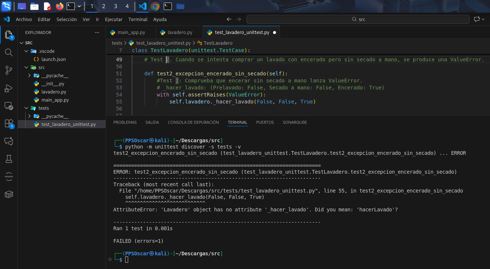

Errores: El test intenta llamar a _hacer_lavado, pero este método no existe en la clase Lavadero.

```AttributeError: 'Lavadero' object has no attribute '_hacer_lavado'
Did you mean: 'hacerLavado'?```

Solución: Añadir _hacer_lavado a lavadero.py

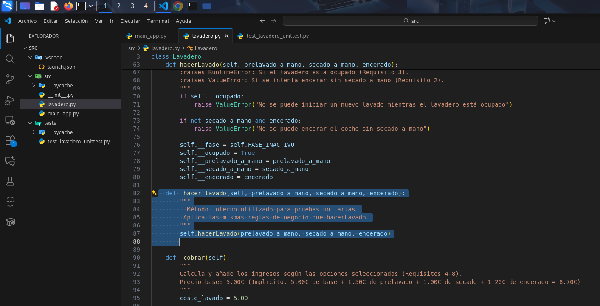

Ejecución tras solucionar error:

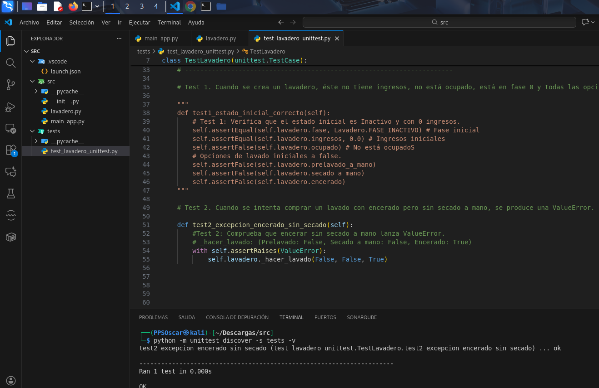

---

- Test 3: Cuando se intenta hacer un lavado mientras que otro ya está en marcha, se produce una ValueError.


Errores: El enunciado dice ValueError, no RuntimeError.

```if self.__ocupado:
    raise RuntimeError("No se puede iniciar un nuevo lavado mientras el lavadero está ocupado")
```

Solución: Cambiar el tipo de excepción.

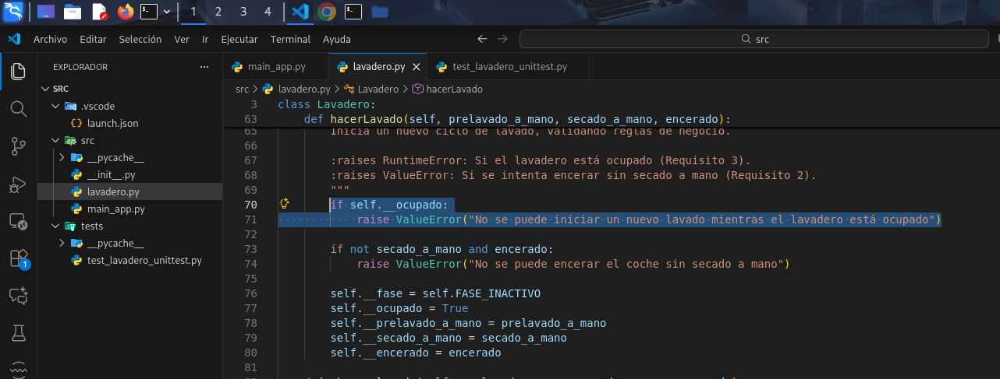

Ejecición tras soluiconar el error:

[solucionado test3](img/Pruebas/solucionado3.png)

---

- Tests 4: Si seleccionamos un lavado con prelavado a mano, los ingresos de lavadero son 6,50€

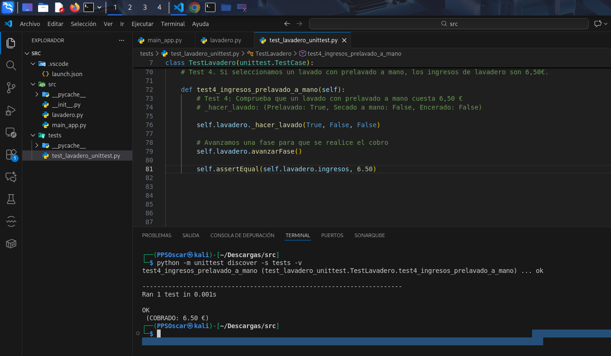

Errores: Este test no muestra errores.

---

- Test 5: Si seleccionamos un lavado con secado a mano, los ingresos son 6,00€.

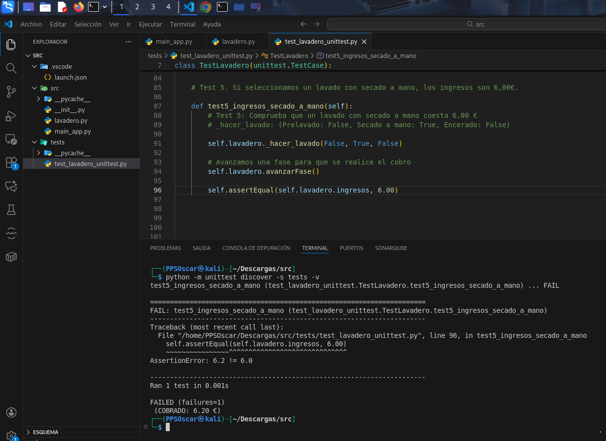

Errores: El coste del lavado está a 1.20, por lo que 5.00 + 1.20 = 6.20.

```if self.__secado_a_mano:
    coste_lavado += 1.20
```

Solución: Cambiar el precio del secado a mano.


Ejecución tras soluiconar el error:

[solucionado test5](img/Pruebas/solucionado5.png)

---

- Test 6: Si seleccionamos un lavado con secado a mano y encerado, los ingresos son 7,20€.


Errores: El coste del encerado tiene que ser 1.20€, no 1.00€

```if self.__encerado:
    coste_lavado += 1.20
```

Solución: Cambiar el precio del secado a mano.


Ejecución tras soluiconar el error:

[solucionado test6](img/Pruebas/solucionado6.png)

---

- Test 7: Si seleccionamos un lavado con prelavado a mano y secado a mano, los ingresos son 7,50€.


Errores: Este test no muestra errores.

---

- Test 8: Si seleccionamos un lavado con prelavado a mano, secado a mano y encerado, los ingresos son 8,70€.


Errores: Este test no muestra errores.

---

- Test 9: Si seleccionamos un lavado sin extras y vamos avanzando fases, el lavadero pasa por las fases 0, 1, 3, 4, 5, 6, 0.

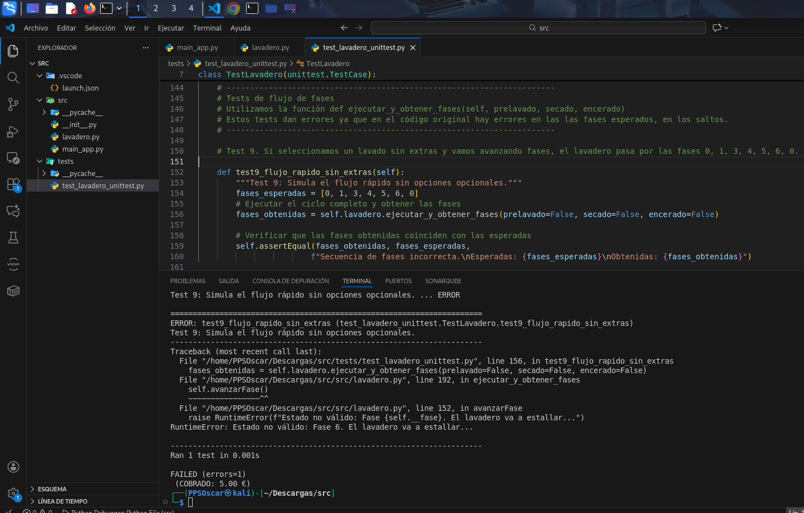

Errores: El método avanzarFase continuaba evaluando estados tras finalizar el lavado. No se retorna.

```       elif self.__fase == self.FASE_RODILLOS:
            if self.__secado_a_mano:
                self.__fase = self.FASE_SECADO_MANO
            else:
                self.__fase = self.FASE_SECADO_AUTOMATICO

        elif self.__fase == self.FASE_SECADO_AUTOMATICO:
            self.terminar()
            return

        elif self.__fase == self.FASE_SECADO_MANO:
            self.terminar()
            return

        elif self.__fase == self.FASE_ENCERADO:
            self.terminar()
            return
```

Solución: Añadir _return_ tras _terminar()_


Ejecución tras soluiconar el error:

[solucionado test9](img/Pruebas/solucionado9.png)

---

- Test 10: Si seleccionamos un lavado con prelavado a mano y vamos avanzando fases, el lavadero pasa por las fases 0, 1, 2, 3, 4, 5, 6, 0.

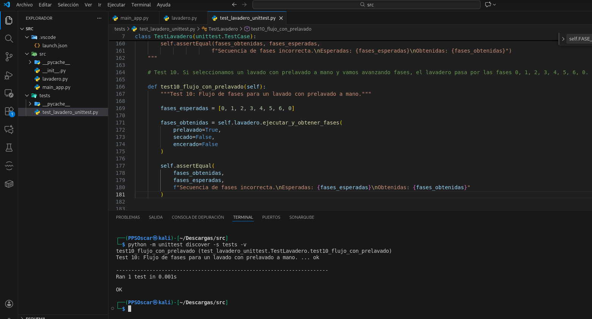

Errores: Este test no muestra errores.

---

- Test 11: Si seleccionamos un lavado con prelavado a mano y vamos avanzando fases, el lavadero pasa por l>

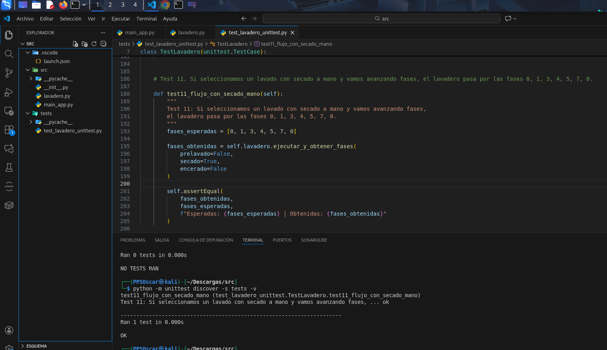

Errores: Este test no muestra errores.

---

- Test 12: Si seleccionamos un lavado con secado a mano y encerado y vamos avanzando fases, el lavadero pasa por las fases 0, 1, 3, 4, 5, 7, 8, 0.


Errores: La fase 8 (encerado) está siendo saltada.

```elif self.__fase == self.FASE_SECADO_MANO:
    self.terminar()
    return
```

Solución:

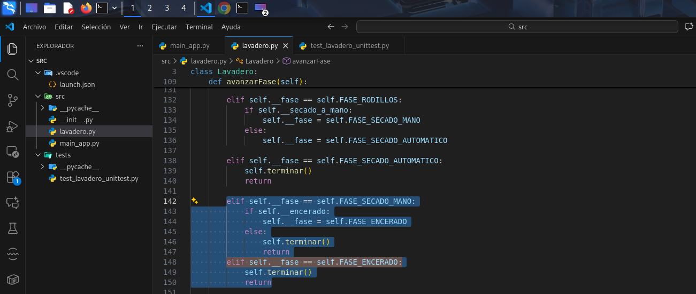

Ejecución tras soluiconar el error:

[solucionado test12](img/Pruebas/solucionado12.png)

---

- Test 13: Si seleccionamos un lavado con prelavado a mano, secado a mano y encerado, y vamos avanzando fases, el lavadero pasa por las fases 0, 1, 2, 3, 4, 5, 7, 8, 0.

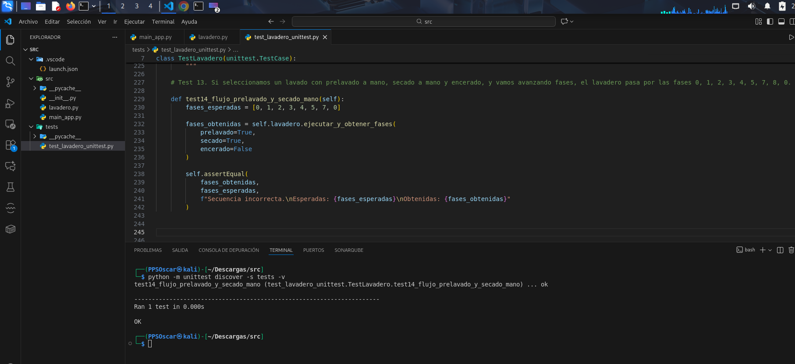

Errores: Este test no muestra errores.

---

- Test 14: Si seleccionamos un lavado con prelavado a mano, secado a mano y encerado, y vamos avanzando fases, el lavadero pasa por las fases 0, 1, 2, 3, 4, 5, 7, 8, 0

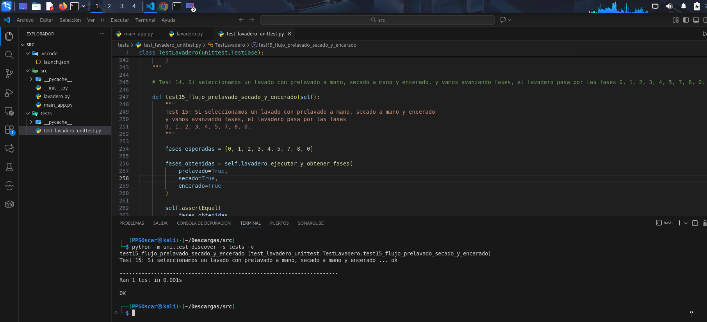

Errores: Este test no muestra errores.

---

## 2. Código corregido

Muestro el código completo corregido como resultado de este apartado:

- lavadero.py

```# lavadero.py

class Lavadero:
    """
    Simula el estado y las operaciones de un túnel de lavado de coches.
    Cumple con los requisitos de estado, avance de fase y reglas de negocio.
    """

    FASE_INACTIVO = 0
    FASE_COBRANDO = 1
    FASE_PRELAVADO_MANO = 2
    FASE_ECHANDO_AGUA = 3
    FASE_ENJABONANDO = 4
    FASE_RODILLOS = 5
    FASE_SECADO_AUTOMATICO = 6
    FASE_SECADO_MANO = 7
    FASE_ENCERADO = 8

    def __init__(self):
        """
        Constructor de la clase. Inicializa el lavadero.
        Cumple con el requisito 1.
        """
        self.__ingresos = 0.0
        self.__fase = self.FASE_INACTIVO
        self.__ocupado = False
        self.__prelavado_a_mano = False
        self.__secado_a_mano = False
        self.__encerado = False
        self.terminar() 

    @property
    def fase(self):
        return self.__fase

    @property
    def ingresos(self):
        return self.__ingresos

    @property
    def ocupado(self):
        return self.__ocupado
    
    @property
    def prelavado_a_mano(self):
        return self.__prelavado_a_mano

    @property
    def secado_a_mano(self):
        return self.__secado_a_mano

    @property
    def encerado(self):
        return self.__encerado

    def terminar(self):
        self.__fase = self.FASE_INACTIVO
        self.__ocupado = False
        self.__prelavado_a_mano = False
        self.__secado_a_mano = False
        self.__encerado = False
    
    def hacerLavado(self, prelavado_a_mano, secado_a_mano, encerado):
        """
        Inicia un nuevo ciclo de lavado, validando reglas de negocio.
        
        :raises RuntimeError: Si el lavadero está ocupado (Requisito 3).
        :raises ValueError: Si se intenta encerar sin secado a mano (Requisito 2).
        """
        if self.__ocupado:
            raise ValueError("No se puede iniciar un nuevo lavado mientras el lavadero está ocupado")
        
        if not secado_a_mano and encerado:
            raise ValueError("No se puede encerar el coche sin secado a mano")
        
        self.__fase = self.FASE_INACTIVO  
        self.__ocupado = True
        self.__prelavado_a_mano = prelavado_a_mano
        self.__secado_a_mano = secado_a_mano
        self.__encerado = encerado

    def _hacer_lavado(self, prelavado_a_mano, secado_a_mano, encerado):
        """
          Método interno utilizado para pruebas unitarias.
         Aplica las mismas reglas de negocio que hacerLavado.
        """
        self.hacerLavado(prelavado_a_mano, secado_a_mano, encerado)
        

    def _cobrar(self):
        """
        Calcula y añade los ingresos según las opciones seleccionadas (Requisitos 4-8).
        Precio base: 5.00€ (Implícito, 5.00€ de base + 1.50€ de prelavado + 1.00€ de secado + 1.20€ de encerado = 8.70€)
        """
        coste_lavado = 5.00
        
        if self.__prelavado_a_mano:
            coste_lavado += 1.50 
        
        if self.__secado_a_mano:
            coste_lavado += 1.00
            
        if self.__encerado:
            coste_lavado += 1.20 
            
        self.__ingresos += coste_lavado
        return coste_lavado

    def avanzarFase(self):
        if not self.__ocupado:
            return

        if self.__fase == self.FASE_INACTIVO:
            self._cobrar()
            self.__fase = self.FASE_COBRANDO

        elif self.__fase == self.FASE_COBRANDO:
            if self.__prelavado_a_mano:
                self.__fase = self.FASE_PRELAVADO_MANO
            else:
                self.__fase = self.FASE_ECHANDO_AGUA

        elif self.__fase == self.FASE_PRELAVADO_MANO:
            self.__fase = self.FASE_ECHANDO_AGUA

        elif self.__fase == self.FASE_ECHANDO_AGUA:
            self.__fase = self.FASE_ENJABONANDO

        elif self.__fase == self.FASE_ENJABONANDO:
            self.__fase = self.FASE_RODILLOS

        elif self.__fase == self.FASE_RODILLOS:
            if self.__secado_a_mano:
                self.__fase = self.FASE_SECADO_MANO
            else:
                self.__fase = self.FASE_SECADO_AUTOMATICO

        elif self.__fase == self.FASE_SECADO_AUTOMATICO:
            self.terminar()
            return

        elif self.__fase == self.FASE_SECADO_MANO:
            if self.__encerado:
                self.__fase = self.FASE_ENCERADO
            else:
                self.terminar()
                return
        elif self.__fase == self.FASE_ENCERADO:
            self.terminar()
            return

        else:
            raise RuntimeError(
                f"Estado no válido: Fase {self.__fase}. El lavadero va a estallar..."
            )


    def imprimir_fase(self):
        fases_map = {
            self.FASE_INACTIVO: "0 - Inactivo",
            self.FASE_COBRANDO: "1 - Cobrando",
            self.FASE_PRELAVADO_MANO: "2 - Haciendo prelavado a mano",
            self.FASE_ECHANDO_AGUA: "3 - Echándole agua",
            self.FASE_ENJABONANDO: "4 - Enjabonando",
            self.FASE_RODILLOS: "5 - Pasando rodillos",
            self.FASE_SECADO_AUTOMATICO: "6 - Haciendo secado automático",
            self.FASE_SECADO_MANO: "7 - Haciendo secado a mano",
            self.FASE_ENCERADO: "8 - Encerando a mano",
        }
        print(fases_map.get(self.__fase, f"{self.__fase} - En estado no válido"), end="")


    def imprimir_estado(self):
        print("----------------------------------------")
        print(f"Ingresos Acumulados: {self.ingresos:.2f} €")
        print(f"Ocupado: {self.ocupado}")
        print(f"Prelavado a mano: {self.prelavado_a_mano}")
        print(f"Secado a mano: {self.secado_a_mano}")
        print(f"Encerado: {self.encerado}")
        print("Fase: ", end="")
        self.imprimir_fase()
        print("\n----------------------------------------")
        
        # Esta función es útil para pruebas unitarias, no es parte del lavadero real
        # nos crea un array con las fases visitadas en un ciclo completo
    def ejecutar_y_obtener_fases(self, prelavado, secado, encerado):
        """Ejecuta un ciclo completo y devuelve la lista de fases visitadas."""
        self._hacer_lavado(prelavado, secado, encerado)
        fases_visitadas = [self.fase]
        
        while self.ocupado:
            # Usamos un límite de pasos para evitar bucles infinitos en caso de error
            if len(fases_visitadas) > 15:
                raise Exception("Bucle infinito detectado en la simulación de fases.")
            self.avanzarFase()
            fases_visitadas.append(self.fase)
            
        return fases_visitadas
```

- test_lavadero_unittest.py:

```# tests/test_lavadero_unittest.py

import unittest
# Importamos la clase Lavadero desde el módulo padre
from src.lavadero import Lavadero

class TestLavadero(unittest.TestCase):
    
    # Método que se ejecuta antes de cada test.
    # Es el equivalente del @pytest.fixture en este contexto.
    def setUp(self):
        """Prepara una nueva instancia de Lavadero antes de cada prueba."""
        self.lavadero = Lavadero()

    # ----------------------------------------------------------------------    
    # Función para resetear el estado cuanto terminamos una ejecución de lavado
    # ----------------------------------------------------------------------
    """
    def test_reseteo_estado_con_terminar(self):
        #Test 4: Verifica  terminar() resetea todas las flags y el estado.
        self.lavadero._hacer_lavado(True, True, True)
        self.lavadero._cobrar()
        self.lavadero.terminar()
        
        self.assertEqual(self.lavadero.fase, Lavadero.FASE_INACTIVO)
        self.assertFalse(self.lavadero.ocupado)
        self.assertFalse(self.lavadero.prelavado_a_mano)
        self.assertTrue(self.lavadero.ingresos > 0) # Los ingresos deben mantenerse
    """ 

    # ----------------------------------------------------------------------
    # TESTS  
    # ----------------------------------------------------------------------

    # Test 1. Cuando se crea un lavadero, éste no tiene ingresos, no está ocupado, está en fase 0 y todas las opciones de lavado (prelavado a mano, secado a mano y encerado) están puestas a false.
   
    """
    def test1_estado_inicial_correcto(self):
        # Test 1: Verifica que el estado inicial es Inactivo y con 0 ingresos.
        self.assertEqual(self.lavadero.fase, Lavadero.FASE_INACTIVO) # Fase inicial
        self.assertEqual(self.lavadero.ingresos, 0.0) # Ingresos iniciales
        self.assertFalse(self.lavadero.ocupado) # No está ocupadoS
        # Opciones de lavado iniciales a false.
        self.assertFalse(self.lavadero.prelavado_a_mano)
        self.assertFalse(self.lavadero.secado_a_mano)
        self.assertFalse(self.lavadero.encerado)
    """

    # Test 2. Cuando se intenta comprar un lavado con encerado pero sin secado a mano, se produce una ValueError.
    """
    def test2_excepcion_encerado_sin_secado(self):
        #Test 2: Comprueba que encerar sin secado a mano lanza ValueError.
        # _hacer_lavado: (Prelavado: False, Secado a mano: False, Encerado: True)
        with self.assertRaises(ValueError):
            self.lavadero._hacer_lavado(False, False, True)
    """

    # Test 3. Cuando se intenta hacer un lavado mientras que otro ya está en marcha, se produce una ValueError.
    """
    def test3_excepcion_lavado_mientras_otro_en_marcha(self):
        # Test 3: Comprueba que no se puede iniciar un lavado si ya hay otro en marcha
        # Primer lavado válido
        self.lavadero._hacer_lavado(False, False, False)

        # Segundo lavado mientras el primero sigue activo → ValueError
        with self.assertRaises(ValueError):
            self.lavadero._hacer_lavado(False, False, False)
    """

    # Test 4. Si seleccionamos un lavado con prelavado a mano, los ingresos de lavadero son 6,50€.

    """
    def test4_ingresos_prelavado_a_mano(self):
        # Test 4: Comprueba que un lavado con prelavado a mano cuesta 6,50 €
        # _hacer_lavado: (Prelavado: True, Secado a mano: False, Encerado: False)

        self.lavadero._hacer_lavado(True, False, False)

        # Avanzamos una fase para que se realice el cobro
        self.lavadero.avanzarFase()

        self.assertEqual(self.lavadero.ingresos, 6.50)
    """

    # Test 5. Si seleccionamos un lavado con secado a mano, los ingresos son 6,00€.
    """
    def test5_ingresos_secado_a_mano(self):
        # Test 5: Comprueba que un lavado con secado a mano cuesta 6,00 €
        # _hacer_lavado: (Prelavado: False, Secado a mano: True, Encerado: False)

        self.lavadero._hacer_lavado(False, True, False)

        # Avanzamos una fase para que se realice el cobro
        self.lavadero.avanzarFase()

        self.assertEqual(self.lavadero.ingresos, 6.00)
    """

    # Test 6. Si seleccionamos un lavado con secado a mano y encerado, los ingresos son 7,20€.

    """
    def test6_ingresos_secado_mano_y_encerado(self):
        # Test 6: Comprueba que un lavado con secado a mano y encerado cuesta 7,20 €
        # _hacer_lavado: (Prelavado: False, Secado a mano: True, Encerado: True)

        self.lavadero._hacer_lavado(False, True, True)

        # Avanzamos una fase para que se realice el cobro
        self.lavadero.avanzarFase()

        self.assertEqual(self.lavadero.ingresos, 7.20)
        """
    
    # Test 7. Si seleccionamos un lavado con prelavado a mano y secado a mano, los ingresos son 7,50€.

    """
    def test7_ingresos_prelavado_y_secado_mano(self):
        # Test 7: Comprueba que un lavado con prelavado a mano y secado a mano cuesta 7,50 €
        # _hacer_lavado: (Prelavado: True, Secado a mano: True, Encerado: False)

        self.lavadero._hacer_lavado(True, True, False)

        # Avanzamos una fase para que se realice el cobro
        self.lavadero.avanzarFase()

        self.assertEqual(self.lavadero.ingresos, 7.50)
        """

    # Test 8. Si seleccionamos un lavado con prelavado a mano, secado a mano y encerado, los ingresos son 8,70€.

    """
    def test8_ingresos_prelavado_secado_y_encerado(self):
    # Test 8: Comprueba que un lavado con prelavado a mano, secado a mano y encerado cuesta 8,70 €
    # _hacer_lavado: (Prelavado: True, Secado a mano: True, Encerado: True)

        self.lavadero._hacer_lavado(True, True, True)

    # Avanzamos una fase para que se realice el cobro
        self.lavadero.avanzarFase()

        self.assertEqual(self.lavadero.ingresos, 8.70)
    """
    
    # ----------------------------------------------------------------------
    # Tests de flujo de fases
    # Utilizamos la función def ejecutar_y_obtener_fases(self, prelavado, secado, encerado)
    # Estos tests dan errores ya que en el código original hay errores en las las fases esperados, en los saltos.
    # ----------------------------------------------------------------------

    # Test 9. Si seleccionamos un lavado sin extras y vamos avanzando fases, el lavadero pasa por las fases 0, 1, 3, 4, 5, 6, 0.

    """
    def test9_flujo_rapido_sin_extras(self):
        #Test 9: Simula el flujo rápido sin opciones opcionales.
        fases_esperadas = [0, 1, 3, 4, 5, 6, 0]
        # Ejecutar el ciclo completo y obtener las fases
        fases_obtenidas = self.lavadero.ejecutar_y_obtener_fases(prelavado=False, secado=False, encerado=False)
        
        # Verificar que las fases obtenidas coinciden con las esperadas
        self.assertEqual(fases_obtenidas, fases_esperadas, 
                        f"Secuencia de fases incorrecta.\nEsperadas: {fases_esperadas}\nObtenidas: {fases_obtenidas}")
    """

    # Test 10. Si seleccionamos un lavado con prelavado a mano y vamos avanzando fases, el lavadero pasa por las fases 0, 1, 2, 3, 4, 5, 6, 0.
    
    """
    def test10_flujo_con_prelavado(self):
        #Test 10: Flujo de fases para un lavado con prelavado a mano.
        
        fases_esperadas = [0, 1, 2, 3, 4, 5, 6, 0]

        fases_obtenidas = self.lavadero.ejecutar_y_obtener_fases(
            prelavado=True,
            secado=False,
            encerado=False
        )

        self.assertEqual(
            fases_obtenidas,
            fases_esperadas,
            f"Secuencia de fases incorrecta.\nEsperadas: {fases_esperadas}\nObtenidas: {fases_obtenidas}"
        )
        """


    # Test 11. Si seleccionamos un lavado con secado a mano y vamos avanzando fases, el lavadero pasa por las fases 0, 1, 3, 4, 5, 7, 0.
    """
    def test11_flujo_con_secado_mano(self):
        fases_esperadas = [0, 1, 3, 4, 5, 7, 0]

        fases_obtenidas = self.lavadero.ejecutar_y_obtener_fases(
            prelavado=False,
            secado=True,
            encerado=False
        )

        self.assertEqual(
            fases_obtenidas,
            fases_esperadas,
            f"Esperadas: {fases_esperadas} | Obtenidas: {fases_obtenidas}"
        )
    """

    # Test 12. Si seleccionamos un lavado con secado a mano y encerado, y vamos avanzando fases, el lavadero pasa por las fases 0, 1, 3, 4, 5, 7, 8, 0.

    """
    def test12_flujo_con_secado_mano_y_encerado(self):
        
        Test 12: Si seleccionamos un lavado con secado a mano y encerado y vamos avanzando fases,
        el lavadero pasa por las fases 0, 1, 3, 4, 5, 7, 8, 0.
        
        fases_esperadas = [0, 1, 3, 4, 5, 7, 8, 0]

        fases_obtenidas = self.lavadero.ejecutar_y_obtener_fases(
            prelavado=False,
            secado=True,
            encerado=True
        )

        self.assertEqual(
            fases_obtenidas,
            fases_esperadas,
            f"Secuencia incorrecta.\nEsperadas: {fases_esperadas}\nObtenidas: {fases_obtenidas}"
        )
        """
    
    # Test 13. Si seleccionamos un lavado con prelavado a mano, secado a mano y encerado, y vamos avanzando fases, el lavadero pasa por las fases 0, 1, 2, 3, 4, 5, 7, 8, 0.
    """
    def test14_flujo_prelavado_y_secado_mano(self):
        fases_esperadas = [0, 1, 2, 3, 4, 5, 7, 0]

        fases_obtenidas = self.lavadero.ejecutar_y_obtener_fases(
            prelavado=True,
            secado=True,
            encerado=False
        )

        self.assertEqual(
            fases_obtenidas,
            fases_esperadas,
            f"Secuencia incorrecta.\nEsperadas: {fases_esperadas}\nObtenidas: {fases_obtenidas}"
        )
    """

    # Test 14. Si seleccionamos un lavado con prelavado a mano, secado a mano y encerado, y vamos avanzando fases, el lavadero pasa por las fases 0, 1, 2, 3, 4, 5, 7, 8, 0.

    def test15_flujo_prelavado_secado_y_encerado(self):
        """
        Test 15: Si seleccionamos un lavado con prelavado a mano, secado a mano y encerado
        y vamos avanzando fases, el lavadero pasa por las fases
        0, 1, 2, 3, 4, 5, 7, 8, 0.
        """

        fases_esperadas = [0, 1, 2, 3, 4, 5, 7, 8, 0]

        fases_obtenidas = self.lavadero.ejecutar_y_obtener_fases(
            prelavado=True,
            secado=True,
            encerado=True
        )

        self.assertEqual(
            fases_obtenidas,
            fases_esperadas,
            f"Secuencia incorrecta.\nEsperadas: {fases_esperadas}\nObtenidas: {fases_obtenidas}"
        )

# Bloque de ejecución para ejecutar los tests si el archivo es corrido directamente
if __name__ == '__main__':
    unittest.main()
```
- main_app.py:

```# main_app.py

# Importar la clase desde el otro archivo (módulo)
from lavadero import Lavadero

# MODIFICACIÓN CLAVE AQUÍ: La función ahora acepta 3 argumentos
def ejecutarSimulacion(lavadero, prelavado, secado_mano, encerado):
    """
    Simula el proceso de lavado para un vehículo con las opciones dadas.
    Ahora acepta una instancia de lavadero.

    :param lavadero: Instancia de Lavadero.
    :param prelavado: bool, True si se solicita prelavado a mano.
    :param secado_mano: bool, True si se solicita secado a mano.
    :param encerado: bool, True si se solicita encerado.
    """
    
    print("--- INICIO: Prueba de Lavado con Opciones Personalizadas ---")
    
    # Mostrar las opciones solicitadas
    print(f"Opciones solicitadas: [Prelavado: {prelavado}, Secado a mano: {secado_mano}, Encerado: {encerado}]")

    # 1. Iniciar el lavado
    try:
        # Esto establece las opciones y pasa a Fase 0 (Inactivo, pero Ocupado=True)
        lavadero.hacerLavado(prelavado, secado_mano, encerado)
        print("\nCoche entra. Estado inicial:")
        lavadero.imprimir_estado()

        # 2. Avanza por las fases
        print("\nAVANZANDO FASE POR FASE:")
        
        # Usamos un contador para evitar bucles infinitos en caso de error o bucles inesperados
        pasos = 0
        while lavadero.ocupado and pasos < 20: 
            # El cobro ahora ocurre en la primera llamada a avanzarFase (transición 0 -> 1)
            lavadero.avanzarFase()
            print(f"-> Fase actual: ", end="")
            lavadero.imprimir_fase()
            print() 
            pasos += 1
        
        print("\n----------------------------------------")
        print("Lavado completo. Estado final:")
        lavadero.imprimir_estado()
        print(f"Ingresos acumulados: {lavadero.ingresos:.2f} €")
        print("----------------------------------------")
        
    except ValueError as e: # Captura la excepción de regla de negocio (Requisito 2)
        print(f"ERROR DE ARGUMENTO: {e}")
    except RuntimeError as e: # Captura la excepción de estado (Requisito 3)
        print(f"ERROR DE ESTADO: {e}")
    except Exception as e:
        print(f"ERROR INESPERADO: {e}")


# Punto de entrada (main): Aquí pasamos los parámetros
if __name__ == "__main__":
    
    lavadero_global = Lavadero() # Usamos una única instancia para acumular ingresos
""""
    # EJEMPLO 1: Lavado completo con prelavado, secado a mano, con encerado (Requisito 8 y 14)
    # Precio esperado: 5.00 + 1.50 + 1.00 + 1.20 = 8.70 €
    print("\n=======================================================")
    print("EJEMPLO 1: Prelavado (S), Secado a mano (S), Encerado (S)")
    ejecutarSimulacion(lavadero_global, prelavado=True, secado_mano=True, encerado=True)
    
    # EJEMPLO 2: Lavado rápido sin extras (Requisito 9)
    # Precio esperado: 5.00 €
    print("\n=======================================================")
    print("EJEMPLO 2: Sin extras (Prelavado: N, Secado a mano: N, Encerado: N)")
    ejecutarSimulacion(lavadero_global, prelavado=False, secado_mano=False, encerado=False)

    # EJEMPLO 3: Lavado con encerado, pero sin secado a mano (Debe lanzar ValueError - Requisito 2)
    print("\n=======================================================")
    print("EJEMPLO 3: ERROR (Encerado S, Secado a mano N)")
    ejecutarSimulacion(lavadero_global, prelavado=False, secado_mano=False, encerado=True)

    # EJEMPLO 4: Lavado con prelavado a mano (Requisito 4 y 10)
    # Precio esperado: 5.00 + 1.50 = 6.50 €
    print("\n=======================================================")
    print("EJEMPLO 4: Prelavado (S), Secado a mano (N), Encerado (N)")
    ejecutarSimulacion(lavadero_global, prelavado=True, secado_mano=False)

    print("\n=======================================================")
print("EJEMPLO ERROR 2: Intentar iniciar un lavado estando ocupado")
"""


# EJEMPLO ERROR 2: Intentar iniciar un lavado estando ocupado (Requisito 3)
"""
lavadero_error = Lavadero()

try:
    # Primer lavado (arranca correctamente)
    lavadero_error.hacerLavado(prelavado_a_mano=False,
                               secado_a_mano=False,
                               encerado=False)

    print("Primer lavado iniciado correctamente")

    # Segundo lavado SIN terminar el primero
    lavadero_error.hacerLavado(prelavado_a_mano=True,
                               secado_a_mano=False,
                               encerado=False)

except Exception as e:
    print(f"EXCEPCIÓN CAPTURADA: {type(e).__name__} -> {e}") # Esperado: RuntimeError
"""

# EJEMPLO ERROR 3: Precio incorrecto del secado a mano (Requisito 7)
"""
print("\n=======================================================")
print("EJEMPLO ERROR 3: Precio incorrecto del secado a mano")

lavadero_error3 = Lavadero()

# Lavado SOLO con secado a mano
lavadero_error3.hacerLavado(prelavado_a_mano=False,
                            secado_a_mano=True,
                            encerado=False)

# Avanzamos SOLO UNA FASE para que se cobre
lavadero_error3.avanzarFase()

print(f"Ingresos tras el cobro: {lavadero_error3.ingresos:.2f} €")
"""

# EJEMPLO ERROR 4: Fase incorrecta tras rodillos (sin secado a mano) (Requisito 13)
"""
print("\n=======================================================")
print("EJEMPLO ERROR 4: Fase incorrecta tras rodillos (sin secado a mano)")

lavadero_error4 = Lavadero()

# Lavado SIN secado a mano
lavadero_error4.hacerLavado(prelavado_a_mano=False,
                            secado_a_mano=False,
                            encerado=False)

# Avanzamos fases manualmente
while lavadero_error4.ocupado:
    print(f"Fase actual: {lavadero_error4.fase}")
    lavadero_error4.avanzarFase()

print(f"Fase final: {lavadero_error4.fase}")
"""

# EJEMPLO ERROR 5: Fase incorrecta tras rodillos (con secado a mano y encerado) (Requisito 13)
""""
print("\n=======================================================")
print("EJEMPLO ERROR 5: La fase de encerado nunca se ejecuta")

lavadero_error5 = Lavadero()

# Lavado con secado a mano y encerado
lavadero_error5.hacerLavado(prelavado_a_mano=False,
                            secado_a_mano=True,
                            encerado=True)

# Avanzamos fases y mostramos todas
while lavadero_error5.ocupado:
    print(f"Fase actual: {lavadero_error5.fase}")
    lavadero_error5.avanzarFase()

print(f"Fase final: {lavadero_error5.fase}")
"""

"""
# EJEMPLO ERROR 6: Uso de atributo inexistente self.lavadero
print("\n=======================================================")
print("EJEMPLO ERROR 6: Uso de atributo inexistente self.lavadero")

lavadero_error6 = Lavadero()

# Llamamos al método de prueba
lavadero_error6.ejecutar_y_obtener_fases(prelavado=False,
                                         secado=False,
                                         encerado=False)
"""
```
