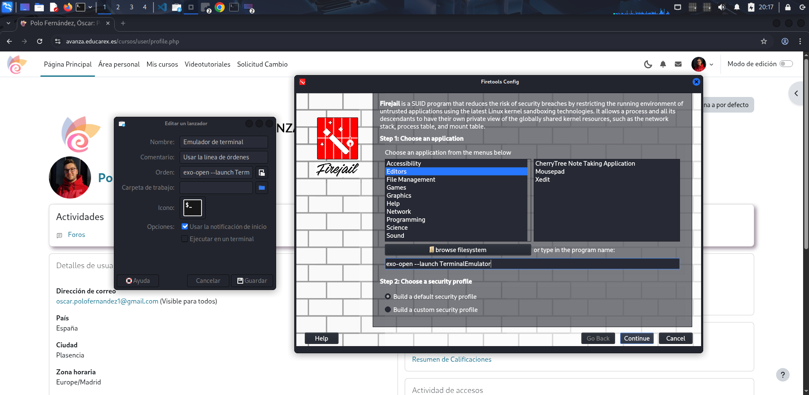

# Ejecución en Sandbox

En este apartado voy a utilizar la herramienta de sandboxing [Firejail](https://github.com/netblue30/firejail). Me va a permitir ejecutar el programa _Lavadero_ de forma aislada a mi sistema, limitando lo que puede ver y hacer.

Dentro de esta herramienta se encuentra _Firetools_, que básicamente es la interfaz gráfica de _Firejail_. Nos permite lanzar la herramienta desde fuera del terminal y muestra las aplicaciones activas.

---

## 1. Instalación y ejecución de la herramienta

En primer lugar, instalo la herramienta y la ejecuto.

---

## 2. Creación de perfil seguro

En segundo lugar, desde la herramienta lanzo el terminal con el perfil seguro corriendo.

En Emulador - Clic derecho - Editar propiedades... Copio la orden del lanzador de la terminal y se la paso a la herramienta para crear un perfil seguro que se va a ejecutar en esa terminal.

Una vez le doy a _Done_, se lanza el terminal en el que estaría el perfil seguro. Podemos ver el PID y la ruta del perfil.

---

## 3. Ejecución del programa

Con _python3_ ejectuto la aplicación en el sandbox.

En la siguiente captura podemos observar uno de los errores que contiene el programa. Se muestra porque para la prueba en sandbox he escogido las versiones de código sin corregir. Se demuestra que todo queda aislado en este entorno.

